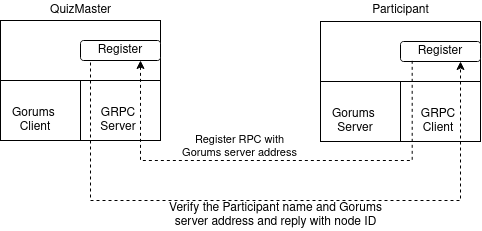
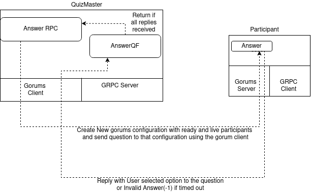
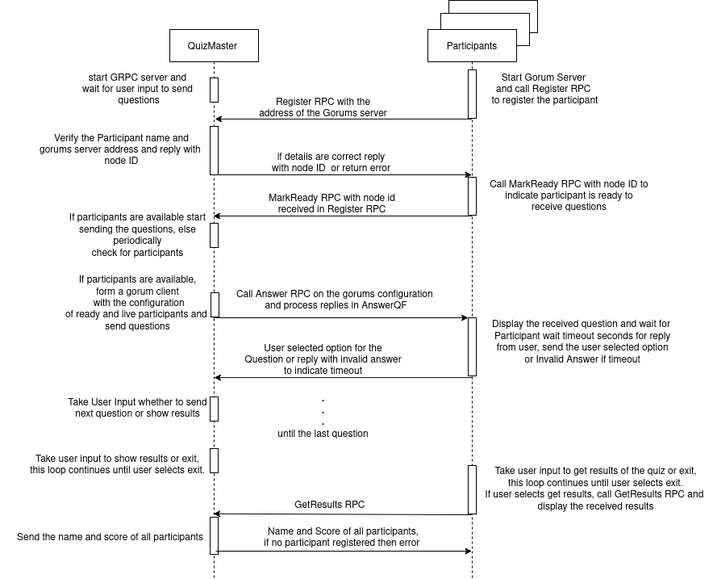

# Quizing platform with gRPC and Gorums

Before implementing this assignment, please check the example programs of the [GRPC][grpc] and [Gorums][gorums].
Upon thorough understanding of these examples proceed to the following details.

In this assignment, you will implement a quizzing platform with GRPC and Gorums as shown in the figure.
You need to implement a quizmaster and participant.
Quizmaster conducts the quiz by sending the questions to the registered and live participants.
A code skeleton is presented to you and students should complete the functions marked with `TODO(student)` in [quizmaster.go](game/quizmaster.go) and [participant.go](game/participant.go).
Protobuf files required for this assignment are present in `proto` directory and these files are sufficient for the implementation of the task and do not edit these files.

The main functions for participant and quizmaster are implemented in [cmd/participant/main.go](cmd/participant/main.go) and [cmd/quizmaster/main.go](cmd/quizmaster/main.go) respectively.
The quizmaster binary takes the grpc server port number as a command line argument.
If no argument is passed then the default port number `50001` is used.
These files contain the code for invoking the participant and quizmaster functionality.
Do not edit these files.


  
## Quizmaster Functionality

For [quizmaster.go](game/quizmaster.go), the following functions should be implemented:

- **StartQuiz**: The `StartQuiz` is the main loop of the Quizmaster.
  It should wait for the at least one live and ready participant before sending the questions.
  You should check every `QuizmasterSleepTimer` seconds until you have alive and ready participants.
  If there is participants available, the quizmaster sends the questions to those participants using the `sendQuestions` function.

  The set of available participants can change for each question, and thus a new gorums configuration 
  is created with ready and available participants for each question.
  You should implement this functionality in `runGorumsClientForEachQuestion` function.

  The Quizmaster should wait for at least `QuizmasterQuestionTimeout` seconds before moving to the next question.
  Go's `context.Context` can be used for this functionality.
  Before it proceeds to the next question, it should take the input from the user to move to the next question or show results.

  ```text
  Select a command:
  1) Send next question
  2) Show results
  ```

  After sending all the questions, the quizmaster should present a option to "show results" or "Exit".

  ```text
  Select a command:
  1) Show results
  2) Exit
  ```

  You can check how the quizmaster and the participants interact using gorums in the Figure below.
  


- **RunGrpcServer**: This function starts the GRPC server in Quizmaster, registering the service and starting the
  listener in the `serverPort`.
  The GRPC server must have the implementations of the handlers below to communicate with the participants.
  Refer [GRPC][grpc] documentation to implement these methods.
  After starting the grpc server, quizmaster is now ready for registration of participants.

- **Register**: The `Register` handler takes participant name and gorums server address as input, verifies them and stores the participant information in the quizmaster structure.
  This function returns the nodeid created for this participant.

- **MarkReady**: The `MarkReady` handler takes the node id of the participant, verifies it whether it is registered participant or not.
  If the participant is a registered participant then mark the participant ready and should be included in the configuration of the next question.

- **GetResults**: The `GetResults` handler should return the score of all the registered participants.

- **AnswerQF**: This is a quorum function, it can be called multiple times until sufficient responses are received.
  Refer to [gorums]( https://github.com/relab/gorums) documentation for more details about quorum functions.
  This function handles the responses to the questions sent to the participants.
  It should verify if a participant has answered the question correctly.
  Correct answers should increment the score of the participant by 100.

  The quorum function returns the tuple `nil, true` once the replies from all participants have arrived and were processed.
  The `replies` argument in the function signature holds the responses from the participants.
  Since this function can be called multiple times to deliver the new responses by the gorums framework,
  your implementation should take care not to process the replies more than once.


## Participant Functionality

The functionality of the participant is implemented in the [participant.go](game/participant.go) file.
A code skeleton is provided with the functions to be filled by you and are marked as `TODO(student)`.
The participant binary takes two command line arguments,
the first one is the name of the participant and the second one is the port on which the quizmaster has started the grpc server.
You can check the available arguments passing `-help` to the binary.
User inputs should be verified before registration with quizmaster.

A participant should implement the following functions:

- **RegisterParticipant**: This function should start a gorums server and register it using `RegisterQuizMasterServer` from the proto file.
  The address of the gorums server should be stored in the `participant` struct in the field `address`.
  Participants are also GRPC clients of the quizmaster, and should register with the quizmaster using the `Register` RPC method.
  The participant's `name` and `address` are used as input to the `Register` method.
  Register RPC returns the node ID and it should be added to the participant struct to be used in subsequent calls, like `MarkReady` RPC.

- **StartQuiz**: This function starts the quiz for the participant and waits until it is mpleted.
  Participant calls the `MarkReady` RPC with the node ID received from the `Register` RPC.
  At this point, the questions can be sent by the quizmaster.
  This function should wait until all the questions are completed.
  Once all the questions are completed it should present a menu with options to `Get results` or `Exit`.

  ```text
  Select a command:
  1) Get results
  2) Exit
  ```

- **Answer**: This function receives the gorums server context and the question from the quizmaster as the parameters.
  It should display the question and the available answers to the user.
  The user will select one answer using the STDIN. 
  The participant waits for `ParticipantReadTimeout` seconds before timeout, in case the user does not select an option.
  If the timeout occurs the participant sends the response with `InvalidAnswer` as payload.

- **GetResults**: This function is used to get the results of all the participants from the quizmaster.
  A participant should wait for `ParticipantGetResultTimeout` seconds before timeout.
  The response should be printed in the STDOUT.

- **ReadOptionFromUser**: This function reads the option from an user from the STDIN and pass it to the
  inputChannel. It reads the input within `ParticipantReadTimeout` seconds
  and if a reply is done by a participant, it sends the reply to the inputChannel.
  In case of timeout, the function should send InvalidAnswer in the inputChannel.
  
## The Game Flow

Below is the sequential diagram of the Game with RPC and Gorums calls.




## Building

You can build the quiz platform by running:

```sh
make all
```
  
The command above compiles the protobuf files and builds the quizmaster and participant binaries under the `bin` folder.

To run the quizmaster, open a terminal and run:
```sh
./bin/quizmaster 50001
```

To run a participant, open another terminal and run:
```sh
./bin/participant participant_name 50001
```

You can run the command above with different `participant_name` to run multiple participants.
The port number must be the port in which the quizmaster is running.

## Evaluation Criteria

To complete this assignment, the application should showcase the following scenarios.

- (40%) At least three participants should participate in the quiz and scores of them should be properly updated based on their inputs.
  You may need to adjust the timeouts in the [const.go](consts.go) file if you require more time to answer the questions or testing. 

- (20%) Participant should be able to join the quiz, after the quiz master started sending questions to other participants.

- (20%) Participant should not answer a question, let it timeout and answer the next question. This should not cause any side effects in scoring.

- (20%) Participant is killed while still participating in the quiz, quizmaster should update the configuration and send next question without a problem.

[grpc]: https://grpc.io/
[gorums]: https://github.com/relab/gorums
