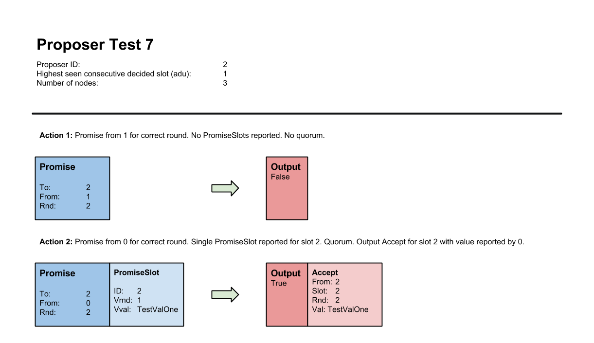
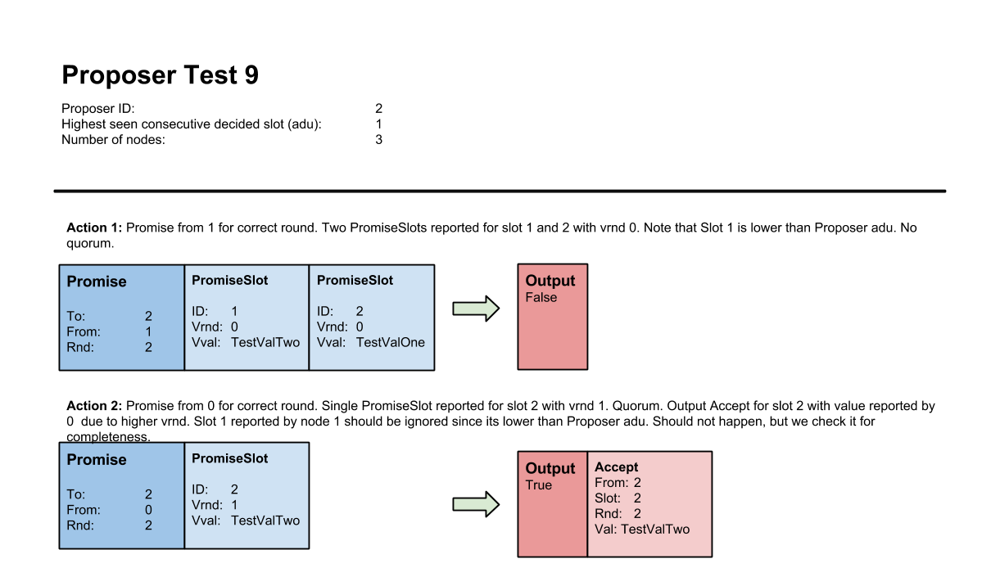
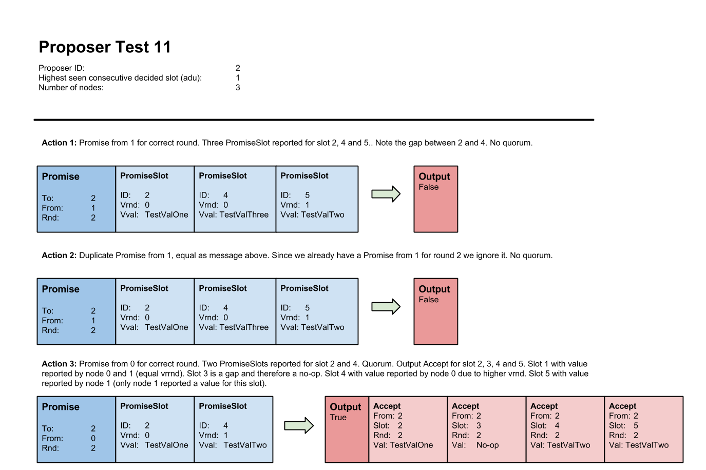

# Lab 4: Single-decree Paxos and Multi-Paxos

| Lab 4: | Single-decree Paxos and Multi-Paxos |
| ---------------------    | --------------------- |
| Subject:                 | DAT520 Distributed Systems |
| Deadline:                | **March 21, 2022 23:59** |
| Expected effort:         | 40-60 hours |
| Grading:                 | Graded |
| Submission:              | Group |

## Table of Contents

1. [Background and Resources](#background-and-resources)
2. [Algorithm implementation](#algorithm-implementation)
3. [Specification](#specification)
4. [Lab Approval](#lab-approval)
5. [Appendix - Proposer Test Cases](#appendix---proposer-test-cases)

## Background and Resources

Practical systems normally use Paxos as a building block to achieve consensus
on a sequence of values.
One way to achieve this would be to run a full instance of single-decree Paxos, both _Phase 1 and 2_,
for every value.
This would require four message delays for every value to be decided.
With Multi-Paxos it is possible to reduce this overhead.

Multi-Paxos only perform _Phase 1_ once, when the leader change.
A Proposer, thinking it is the new leader, issues a prepare for every slot higher than the highest
consecutive decided slot it has seen.
Every other Paxos acceptors respond to it with a promise if the round is higher than their current one.
The promise message may contain a set of `(vrnd, vval)` tuples for every slot higher or equal to the
one from the prepare message, if the acceptor has accepted any value for these slots.

On receiving a quorum of promises, the Proposer is bounded by the highest
`(vrnd, vval)` tuple reported for any slot higher than the slot from the corresponding
prepare message.
The Proposer can then perform _Phase 2_ (accept and learn) for every value to be decided.
Only two message delays are required to get a value accepted.

You are _strongly_ advised to read Section 3, _Implementing a State Machine_,
from _Paxos Made Simple_ by Leslie Lamport for a more complete description of the Multi-Paxos optimization.
You may also find the other [resources](../resources/) listed here useful.

## Algorithm implementation

You will in this task implement the Multi-Paxos algorithm for each of the three
Paxos roles.
The task is similar to what you did for single-decree Paxos, but is more complex since
Multi-Paxos is able to choose multiple commands.
Both _Phase 1_ and _Phase 2_ of the Paxos protocol (as described in _Paxos Made Simple_) needs to be
adjusted.
Especially the prepare-promise exchange need changes.

The skeleton code, unit tests and definitions for this assignment can be found in this package
(i.e. multipaxos).
Each of the three Paxos roles has a separate file for skeleton code (e.g. `acceptor.go`) and one for
unit tests (e.g. `acceptor_test.go`).
There is additionally a single file called `defs.go`.
This file contain `struct` definitions for the four Paxos messages and other related
definitions.
You should not edit this file.

Similar to the single-decree Paxos each of the three Paxos roles has a similar skeleton code structure.
They all have a constructor, e.g. `NewAcceptor(...) *Acceptor`.
Each Paxos role also have a `handle` method for each message type they should receive.
For example, the Acceptor has a method for processing accept messages with the following signature:

```go
func (a *Acceptor) handleAccept(acc Accept) (lrn Learn, output bool)
```

A `handle` method returns a Paxos message and a boolean value `output`. The
value `output` indicate if handling the message resulted in an output message
from the Paxos module. Example: If an acceptor handles an accept message and
should according to the algorithm reply with a learn message, then the
`handleAccept` would return with `output` set to true and the corresponding
learn message as `lrn`. If handling the accept resulted in no outgoing learn
message, then `output` should be set to false. In other words, the caller
should _always_ check the value of `output` before eventually using the Paxos
message. If `output` is false, then each field of the Paxos message struct
should have the zero value (e.g. initialized using an empty struct literal,
`Acceptor{}`).

The `handleLearn` method from `learner.go` has the following signature:

```go
func (l *Learner) handleLearn(lrn Learn) (val Value, sid SlotID, output bool)
```

The method does not output a Paxos message. The return value `val` instead
represents a value for a specific slot (`sid`) that the Paxos nodes has reached
consensus on (i.e. decided).
A difference from the single-decree Paxos learner of the previous task is the return value `sid SlotID`.
This return value indicates what slot the corresponding decided value (`val`) belongs to.
The `Value` type definition (in `defs.go`) has also changed from being a type alias for `string` in
the previous task to the following struct definition for this task:

```go
type Value struct {
	ClientID  string
	ClientSeq int
 	Noop      bool
	Command   string
}
```

The `Value` type now also carries information about the client that sent the
command. `ClientID` is a unique client identifier. `ClientSeq` represents a
client sequence number. The number would be used by clients to match a
response received from a Paxos system to a corresponding request. The actual
value is now represented by a `Command` field of type `string`.

The `Round` type definition found in `defs.go` still unchanged:

```go
type Round int

const NoRound Round = -1
```

The Paxos messages has changed slightly to the following:

```go
type Prepare struct {
	From int
	Slot SlotID
	Crnd Round
}

type Promise struct {
	To, From int
	Rnd      Round
	Slots    []PromiseSlot
}

type Accept struct {
	From int
	Slot SlotID
	Rnd  Round
	Val  Value
}

type Learn struct {
	From int
	Slot SlotID
	Rnd  Round
	Val  Value
}
```

The `Prepare`, `Accept` and `Learn` messages have all gotten a `Slot` field of type `SlotID`.
This means that every `Accept` and `Learn` message now relates to a specific slot.
The `Slot` field in the `Prepare` message has a somewhat different meaning.
In Multi-Paxos, as explained [previously](#background-and-resources), a proposer only
executes Phase 1 once on every leader change if it considers itself the leader.
The `Slot` field in the `Prepare` message represents the slot after the highest
consecutive decided slot the Proposer has seen.
This slot identifier is used by an acceptor to construct a corresponding `Promise` as a reply.
An acceptor attach information (`vrnd` and `vval`) for every slot it has sent an accept for
equal or higher to the one received in the prepare message.
This information is stored in the slice `Slots` of type `PromiseSlot`.
The slice should be sorted by increasing `SlotID`. The `PromiseSlot` struct is defined in `defs.go`:

```go
type PromiseSlot struct {
	ID   SlotID
	Vrnd Round
	Vval Value
}
```

To create and append the correct slots (if any) to the slice, an acceptor need
to keep track of the highest seen slot it has sent an accept for. This can for
example be done by maintaining a `maxSlot` variable of type `SlotID`. The
Proposer is bounded by the highest `PromiseSlot` (highest `vrnd`) reported in a
quorum for any slot higher than the slot from a corresponding prepare message.

The `handlePromise` method from `proposer.go` has the following signature:

```go
func (p *Proposer) handlePromise(prm Promise) (accs []Accept, output bool)
```

### Specification

* *Input:* A single `Promise` message.

* The Proposer should ignore a promise message if the promise has a round
  different from the Proposer's current round, i.e. it is not an answer to a
  previously sent prepare from the Proposer.

* The Proposer should ignore a promise message if it has previously received a
  promise from the _same_ node for the _same_ round.

* *Output:* If handling the input promise result in a quorum for the current
  round, then `accs` should contain a slice of accept message for the slots the
  Proposer is bound in. If the Proposer is not bounded in any slot the `accs`
  should be an empty slice. If `output` is false then `accs` should be `nil`.

* All accept messages in the `accs` slice should be in increasing consecutive
  slot order.

* If there is a gap in the set of slots the Proposer is bounded by, e.g. it is
  bounded in Slot 2 and 4 but not 3, then the Proposer should create an accept
  message with a no-op value for the accept for Slot 3 in the `accs` slice.

* If a `PromiseSlot` in a promise message is for a slot lower than the
  Proposer's current `adu` (all-decided-up-to), then the `PromiseSlot` should
  be ignored.

You can find a complete description of proposer test case number 7-11
[here](#appendix---proposer-test-cases).

A few other important aspects of the Paxos roles are listed below:

* A `Promise` message does, for the sake of simplicity, not indicate if a slot
  (`PromiseSlot`) above the slot identifier from the `Prepare` is decided or
  not (the new leader may not have previously learnt it). In this case a slot
  will be proposed and decided again. The Paxos protocol ensure that the same
  value will be decided for the same slot.

* An acceptor only need to maintain a single `rnd` variable (as for
  single-decree Paxos). The `rnd` variable spans across all slots. Only `vrnd`
  and `vval` must be stored for each specific slot. Similarly, the Proposer
  only need to maintain a single `crnd` variable.

* The Paxos roles share no slot history/storage in this implementation. Each
  role should maintain their own necessary variables and data structures for
  keeping track of promises, accepts and learns for each slot.

Summarized, you should for this task implement the following (all marked with
`TODO(student)`):

* Any **unexported** field you may need in the `Proposer`, `Acceptor` and
  `Learner` struct.

* The constructor for each of the Paxos roles: `NewAcceptor` and
  `NewLearner`.
  The `NewProposer` constructor is already implemented. Note that the Proposer
  also take its `adu` as an argument due to testing purposes.

* The `handlePrepare` and `handleAccept` method in `acceptor.go`.

* The `handleLearn` method in `learner.go`.

* The `handlePromise` method in `proposer.go`.

Each of the three Paxos roles has a `_test.go` file with unit tests. You should
not edit these files. If you wish to write your own test cases, which is
something that we encourage you to do, then do so by creating separate test
files. How to run the complete test suite or an individual test cases has been
thoroughly described in previous lab assignments.

The test cases for each Paxos role is a set of actions, more specifically a
sequence of message inputs to the `handle` methods. The test cases also provide
a description of the actual invariant being tested. You should take a look at
the test code to get an understanding of what is going on. An example of a
failing acceptor test case is shown below:

```go
=== RUN TestHandlePrepareAndAccept
--- FAIL: TestHandlePrepareAndAccept (0.00s)
        acceptor_test.go:17:
                HandlePrepare
                test nr:1
                action nr: 2
                action description: prepare slot 1, crnd 1 -> no output, ignore due to lower crnd
                want no output
                got Promise{To: -1, From: -1, Rnd: 0, No values reported}

```

*Note:* This task is solely the core message handling for each Multi-Paxos role.
You may need to add fields to each Multi-Paxos role struct to maintain the state.

## Lab Approval

To have your lab assignment approved, you must come to the lab during lab hours
and present your solution. It is also possible to present your work online using the Discord.
The goal is that you present the thoughts and process behind your solution, providing to us more
information for approval purposes and we may also provide feedbacks on your solution.
When you are ready to show your solution, reach out to a member of the teaching staff.
You can also use the Discord bot to request a lab approval, by typing `!approve`.
A staff will be notified and enter in contact with you to mark an appointment.
Please, note that due to the limit number of teaching assistants you need to plan in advance when
you want to get your lab approved.
If you let for the last day or hours before the final deadline, a staff may not be available.
It is expected that you can explain your code and show how it works.
You may show your solution on a lab workstation or your own computer.

**The results from QuickFeed will be taken into consideration when approving this lab.**

For this lab you should present your code and explain what you implemented, comparing the multi-paxos
implementation with the single-decree Paxos.
You should demonstrate that your implementation fulfills the previously listed specification and that
you understood the particularities of each protocol.
The task will be verified by a member of the teaching staff during lab hours.

Also see the [Grading and Collaboration Policy](https://github.com/dat520-2022/info/blob/main/policy.md)
document for additional information.

## Appendix - Proposer Test Cases








